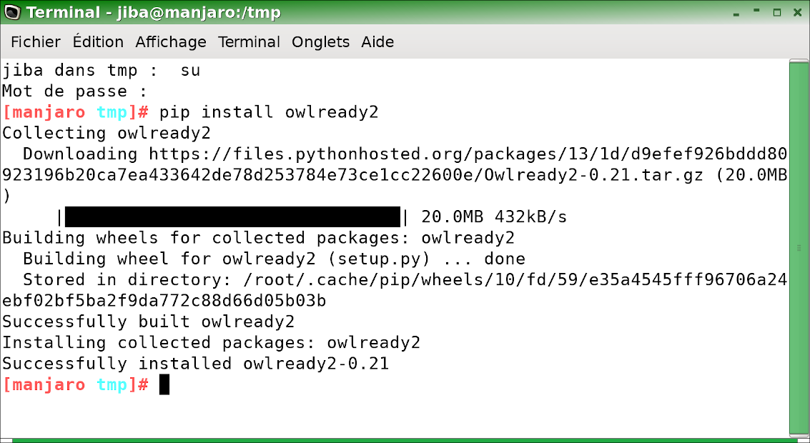
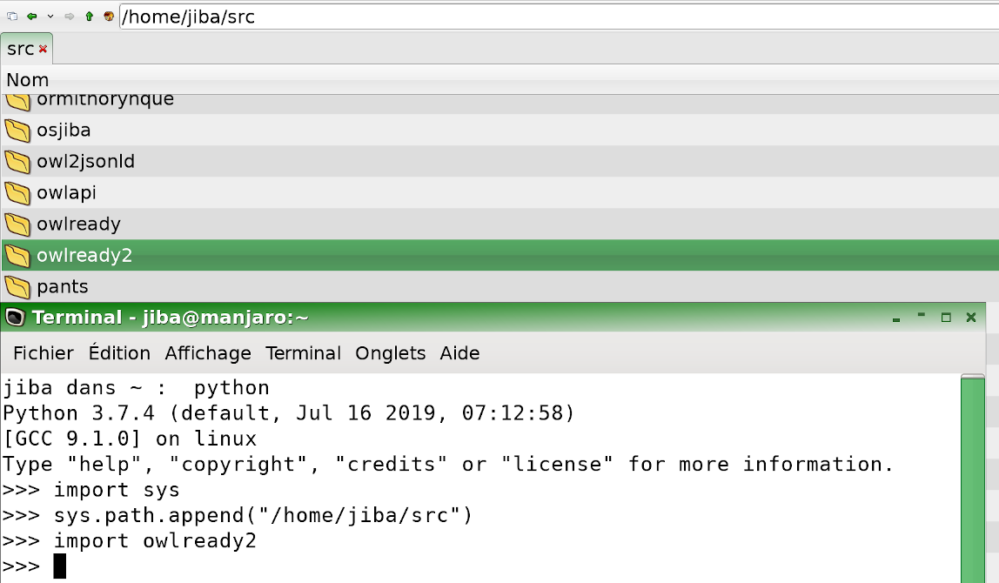

Owlready2 Installation
======================

Owlready2 can be installed with 'pip', the Python Package Installer.

Owlready2 include an optimized Cython module. This module speeds up by about 20% the loading of large ontologies,
but its use is entirely optional.
To build this module, you need a C compiler, and to install the 'cython' Python package.

On the contrary, if you don't have a C compiler, to **not build** the optimized module you need to uninstall
Cython if it is already installed (or to use the manual installation described below).

Owlready2 can be installed from terminal, from Python, or manually.

Installation from terminal (Bash under Linux or DOS under Windows)
------------------------------------------------------------------

You can use the following Bash / DOS commands to install Owlready2 in a terminal:

::

   pip install owlready2

   
If you don't have the permissions for writing in system files,
you can install Owlready2 in your user directory with this command:

::

   pip install --user owlready2

Installation in Spyder / IDLE (or any other Python console)
-----------------------------------------------------------

You can use the following Python commands to install Owlready2 from a Python 3.7.x console
(including those found in Spyder3 or IDLE):

::

   >>> import pip.__main__
   >>> pip.__main__._main(["install", "--user", "owlready2"])

.. figure:: _images/spyder_installation.png

   
Manual installation
-------------------

Owlready2 can also be installed manually in 3 steps:

# Uncompress the Owlready2-0.21.tar.gz source release file (or any other version), for example in C:\\ under Windows

# Rename the directory C:\\Owlready2-0.21 as C:\\owlready2

# Add the C:\\ directory in your PYTHONPATH; this can be done in Python as follows:

  ::

     import sys
     sys.path.append("C:\")
     import owlready2

In the following screenshot, I used /home/jiba/src instead of C:\\, under Linux:

