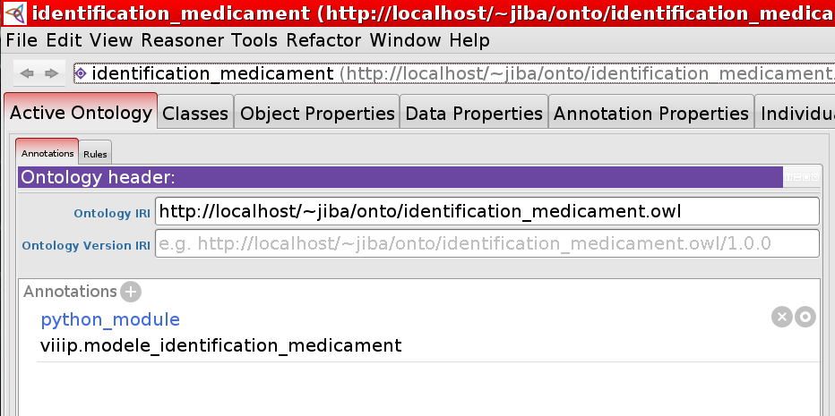

Mixing Python and OWL
=====================

Adding Python methods to an OWL Class
-------------------------------------

Python methods can be defined in ontology Classes as usual in Python. In the example below, the Drug Class
has a Python method for computing the per-tablet cost of a Drug, using two OWL Properties (which have been
renamed in Python, see :ref:`associating-python-alias-name-to-properties`):

::

   >>> from owlready2 import *
   
   >>> onto = get_ontology("http://test.org/onto.owl")
   
   >>> with onto:
   ...     class Drug(Thing):
   ...         def get_per_tablet_cost(self):
   ...             return self.cost / self.number_of_tablets
   
   ...     class has_for_cost(Drug >> float, FunctionalProperty):
   ...         python_name = "cost"
   
   ...     class has_for_number_of_tablets(Drug >> int, FunctionalProperty):
   ...         python_name = "number_of_tablets"
   
   >>> my_drug = Drug(cost = 10.0, number_of_tablets = 5)
   >>> print(my_drug.get_per_tablet_cost())
   2.0

Forward declarations
--------------------

Sometimes, you may need to forward-declare a Class or a Property.
If the same Class or Property (same name, same namespace) is redefined, the new definition **extends**
the previous one (and do not replace it!).

For example:

::
   
   >>> class has_for_active_principle(Property): pass
   
   >>> with onto:
   ...     class Drug(Thing): pass
   
   ...     class has_for_active_principle(Drug >> ActivePrinciple): pass
   
   ...     class Drug(Thing): # Extends the previous definition of Drug
   ...         is_a = [has_for_active_principle.some(ActivePrinciple)]
   
(Notice that this definition of drug exclude Placebo).

Associating a Python module to an OWL ontology
----------------------------------------------

It is possible to associate a Python module with an OWL ontology. When Owlready2 loads the ontology,
it will automatically import the Python module.
This is done with the 'python_module' annotation, which should be set on the ontology itself.
The value should be the name of your Python module, *e.g.* 'my_package.my_module'.
This annotation can be set with editor like Protégé, after importing the 'owlready_ontology.owl' ontology
(file 'owlready2/owlready_ontology.owl' in Owlready2 sources, URI http://www.lesfleursdunormal.fr/static/_downloads/owlready_ontology.owl):

The Python module can countain Class and Properties definitions, and methods.
However, it does not need to include all the is-a relations, domain, range,...: any such relation
defined in OWL does not need to be specified again in Python. Therefore, if your Class hierarchy is
defined in OWL, you can create all Classes as child of Thing.

For example, in file 'my_python_module.py':

::

   >>> from owlready2 import *
   
   >>> onto = get_ontology("http://test.org/onto.owl") # Do not load the ontology here!
   
   >>> with onto:
   ...     class Drug(Thing):
   ...         def get_per_tablet_cost(self):
   ...             return self.cost / self.number_of_tablets

And then, in OWL file 'onto.owl', you can define:

 * The 'python_module' annotation (value: 'my_python_module')
 * The 'Drug' Class with superclasses if needed
 * The 'has_for_cost' Property (ommitted in Python -- not needed because it has no method)
 * The 'has_for_number_of_tablets' Property (also ommitted)

In this way, Owlready2 allows you to take the best of Python and OWL!
